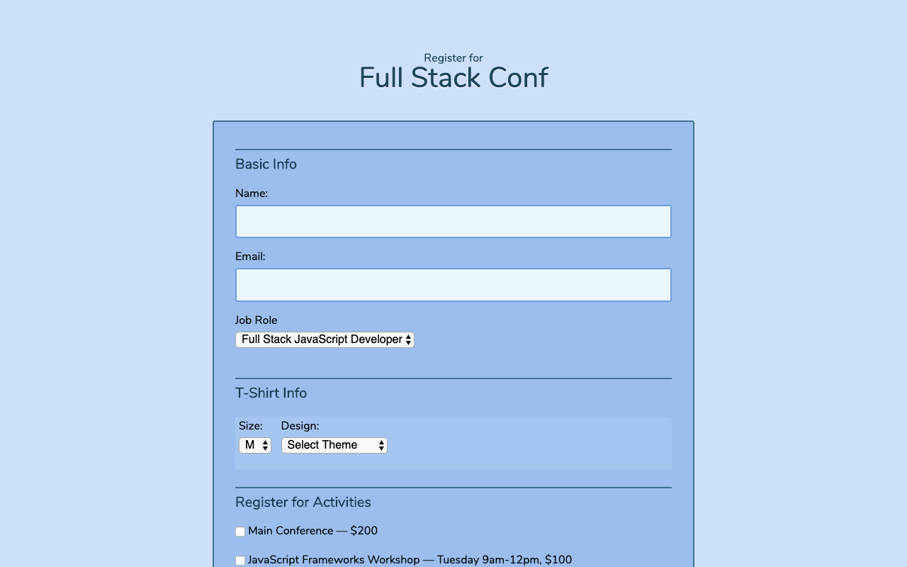

# interactiveform

 
In this project, I'll use JavaScript to enhance an interactive registration form for a fictional conference called "FullStack Conf." Using the supplied HTML and CSS files, I'll add my own JavaScript to make the form more user-friendly by:

* Adding customized and conditional behavior and interactivity.
* Validating user input and providing helpful error messages when the user enters invalid information into the form fields.